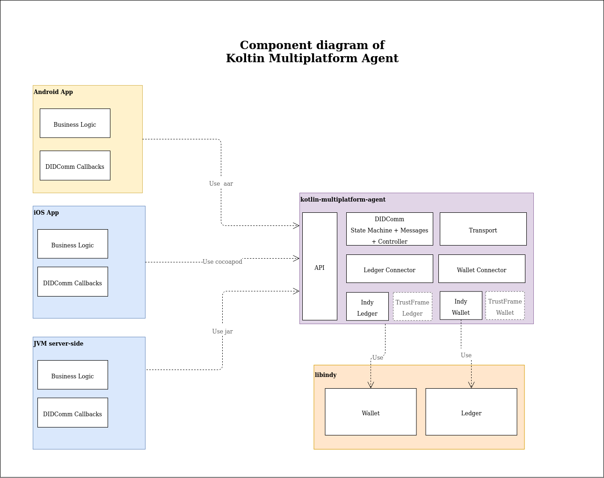
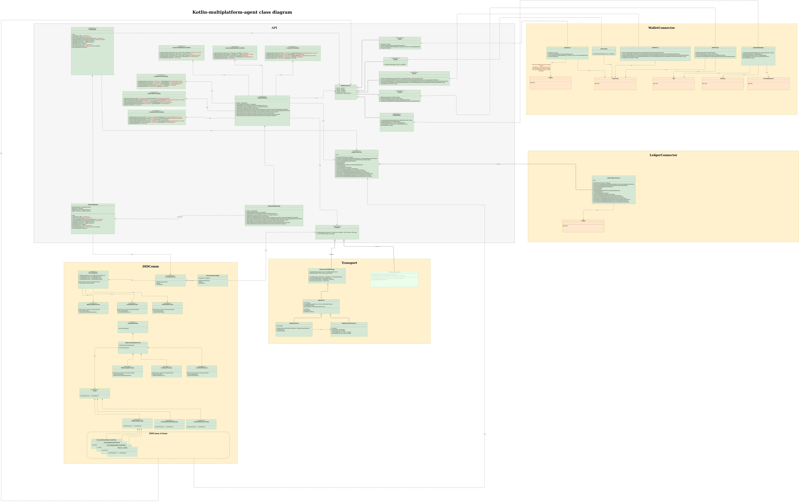
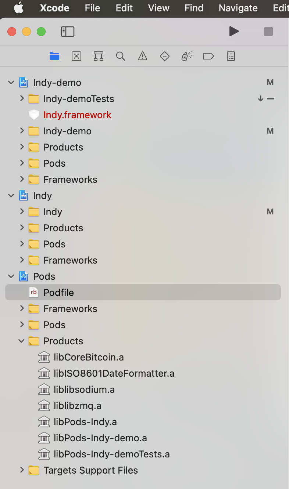

# Overview

This is initial POC of multiplatform library which works without intermediate cloud agent and implements did connection
protocol Currently work is in progress and there are a lot of TODOs in the code.

# Self Sovereign Identity Kotlin Multiplatform Agent

Kotlin Multiplatform Agent is a multiplatform library which implements functionality of SSI Agent and intended to be
compatible with https://github.com/hyperledger/aries-rfcs

Currently it supports following platforms and if necessary can be extended to other platforms.

- JVM -> jar
- Android -> aar
- iOS -> cocoapod

See https://kotlinlang.org/docs/multiplatform.html for details on how this multiplatform technology works.

A new Kotlin Multiplatform Agent to use with Self Sovereign Identity (SSI) applications is available as an open-source
project from Luxoft DXC. The SSI Kotlin Multiplatform Agent provides libraries and tools to accelerate integration of
digital wallet capabilities into existing mobile apps.

With Kotlin Multiplatform Agent developers can leverage secure communication protocols and exchange Verifiable
Credentials in mobile solutions. Digital wallets are a key component in the evolving SSI standards and ecosystems.
Kotlin Multiplatform Agent is based on Hyperledger Indy, stores Verifiable Credentials directly on the device, giving
users to full control over how, and with whom, their information is shared.

Building SSI capabilities into your mobile applications helps facilitates managing, compliance, liability, and security,
for Identity-based use cases such as:

* Single sign-on across systems without username or passwords
* Proof of qualifications or accreditations such as diplomas
* Legal consent without face-to-face interaction
* In-app payments or asset transfers The SSI Mobile SDK enables developers to use zero-knowledge proofs empower their
  users to share personal information while preserving confidentiality and privacy. By open sourcing this project, under
  the Apache 2.0 license, Luxoft & DXC encourages standard approaches across internal projects and benefits from the
  transparency of technical peer-review from the community.

# Architecture

Currently the library uses [indy](https://github.com/hyperledger/indy-sdk) as underlying technology for managing ledger
and wallet but it is designed with abstractions which allow to use any other libs. It has pluggable WalletConnetor and
LedgerConnector which allows to plug in any technology. As a transport layer it currently uses websockets but it allows
any pluggable implementation and it is easy to add it for other transports.

Diagram below present high-level view on components.

- **API** - high level Kotlin interfaces for using of its functions
- **DIDComm** - implementation of DIDComm protocol
- **Transport** - pluggable module for transport. Initially it will use websockets, but it will allow to plug in any
  transport protocol.
- **Ledger Connector** - Connector allowing to use plug-able ledger
- **Wallet Connector** - Connector allowing to use plug-able wallet
- **Indy Ledger and Wallet** - Indy Implementation of Ledger and Wallet




# Usage

Usage is the same across platforms. Main difference will be only in addding dependency for the project. For android it
will be aar from some maven repository and for ios it will be cocoapod. For the platform specific details see specific
sections below.

In general before using ths library you must build and initialize it.

Example is given for android, but it will be almost the same for all platforms

Before using the library we need to initialize Environment using the code below:

```kotlin
  EnvironmentUtils.initEnvironment(EnvironmentImpl(this))
```

Next use *WalletManager* in order to check if wallet exists or not and create it if it does not exists. Those checks are
responsibility of application developer, because there are unrecoverable user data at stake, thus it was decided that
library should not manage this automatically. Once you have generated DID you need to store it somewhere in order to
reuse it on application restart.

```kotlin 
    val walletName = "newWalletName1"
    val walletPassword = "newWalletPassword"
    val did = "Kg5Cq9vKv7QrLfTGUP9xbd"
    val walletManager: WalletManager = IndyWalletManager

    if (!walletManager.isWalletExistsAndOpenable(walletName, walletPassword))
        walletManager.createWallet(walletName, walletPassword)

    if (!walletManager.isDidExistsInWallet(did, walletName, walletPassword)) {
        val didResult = walletManager.createDid(walletName = walletName, walletPassword = walletPassword)
        println("Generated didResult: $didResult")
    //Store did somewhere in your application to use it afterwards
    }
```

After we have checked that wallet exists and contains did we can proceed with configuring the library to use it and the
code below build the wallet connector.

```kotlin
val walletHolder = IndyWalletHolder(
    walletName = walletName,
    walletPassword = walletPassword,
    didConfig = DidConfig(did = did)
)

val indyWalletConnector = IndyWalletConnector.build(walletHolder)
```

Here we define that lib should build genesys.txn file based on ip address of public ledger. Alternatively it is possible
to use IndyLedgerConnectorConfiguration.GenesisMode.FILE and specify existing genesis file.

```kotlin
val indyLedgerConnectorConfiguration = IndyLedgerConnectorConfiguration(
    genesisMode = IndyLedgerConnectorConfiguration.GenesisMode.IP,
    ipAddress = "192.168.0.117"
)
```

Next we build the library providing all pluggable parts. Business logic is encapusalted in controllers called at
different stages of connection and credential lifecycle. Only those controller which we need for our specific business
case should be defined. For example for case of holder mobile library we need to define following controllers.

- ConnectionInitiatorController
- CredPresenterController
- CredReceiverController

ANd we do not need to define controllers for issuence credentials or accepting connection.

```kotlin
    val ssiAgentApi = SsiAgentBuilderImpl(indyWalletConnector)
    .withConnectionInitiatorController(ConnectionInitiatorControllerImpl())
    .withCredReceiverController(CredReceiverControllerImpl())
    .withCredPresenterController(CredPresenterControllerImpl())
    .withLedgerConnector(IndyLedgerConnector(indyLedgerConnectorConfiguration))
    .build()

ssiAgentApi.init()
```

After that we can use connect function to establish connection.

```kotlin
ssiAgentApi.connect()
```

You can intervene into connecting process by placing your custom logic into ConnectionInitiatorController methods.

# Android usage

Important! Currently we do not have defined artifact location , so in the example below I will use mavenLocal
repository.

## Build parent project and publish android artifact to mavenLocal repo

//TODO: remove this section and have permanent location for an artifact

1. Build artifact and publish it to maven local
   ```
   gradlew :publishAndroidPublicationToMavenLocal
   ```
2. Ensureit appeared there under folder "~/.m2/repository/com/dxc/kotlin-multiplatform-agent-android/1.0-SNAPSHOT"

## Add dependencies to gradle

Add repositories to your gradle build

```kotlin
 repositories {
    mavenLocal()
    google()
    jcenter()
    maven(url = "https://repo.sovrin.org/repository/maven-releases")
}
```

Add packaging options below in android defaultConfig

```kotlin
android {
    ...
    defaultConfig {
        ...
        packagingOptions {
            pickFirst("lib/arm64-v8a/libjnidispatch.so")
            pickFirst("lib/armeabi-v7a/libjnidispatch.so")
            pickFirst("lib/x86/libjnidispatch.so")
            exclude("META-INF/AL2.0")
            exclude("META-INF/LGPL2.1")
        }

    }


```

Add following dependencies

```kotlin
dependencies {
    implementation("com.dxc:kotlin-multiplatform-agent-android:1.0-SNAPSHOT@aar")
    implementation("co.touchlab:stately-isolate:1.1.4-a1")
    implementation("co.touchlab:stately-iso-collections:1.1.4-a1")
    implementation("org.hyperledger:indy:1.16.0") {
        exclude(group = "net.java.dev.jna", module = "jna")
        exclude(group = "org.slf4j", module = "slf4j-api")
    }
    implementation("net.java.dev.jna:jna:5.8.0@aar")
    implementation("org.slf4j:slf4j-simple:1.7.26")
    implementation("org.jetbrains.kotlinx:kotlinx-serialization-json:1.0.1")
    implementation("io.ktor:ktor-utils:1.5.1")
    implementation("io.ktor:ktor-client-android:1.5.1")
    implementation("com.squareup.okhttp3:okhttp:4.9.1")
}
```

## Add required permissions to android app

Add to AndroidManifest.xml <uses-permission> tags and android:usesCleartextTraffic="true", android:
requestLegacyExternalStorage="true"  as below.

```xml

<manifest>
    ...
    <uses-permission android:name="android.permission.WRITE_EXTERNAL_STORAGE"/>
    <uses-permission android:name="android.permission.READ_EXTERNAL_STORAGE"/>
    <uses-permission android:name="android.permission.INTERNET"/>
    <uses-permission android:name="android.permission.ACCESS_NETWORK_STATE"/>
    <application
    ...
    android:usesCleartextTraffic="true"
    android:requestLegacyExternalStorage="true"
    >
</manifest>
```

android:usesCleartextTraffic="true"

request those permissions in runtime

## Library initialization

```kotlin
EnvironmentUtils.initEnvironment(EnvironmentImpl(this))

val walletManager: WalletManager = IndyWalletManager

if (!walletManager.isWalletExistsAndOpenable(walletName, walletPassword))
    walletManager.createWallet(walletName, walletPassword)

if (!walletManager.isDidExistsInWallet(did, walletName, walletPassword)) {
    val didResult = walletManager.createDid(walletName = walletName, walletPassword = walletPassword)
    println("Generated didResult: $didResult")
    //Store did somewhere in your application to use it afterwards
}

val walletHolder = IndyWalletHolder(
    walletName = walletName,
    walletPassword = walletPassword,
    didConfig = DidConfig(did = did)
)

val indyWalletConnector = IndyWalletConnector.build(walletHolder)

val indyLedgerConnectorConfiguration = IndyLedgerConnectorConfiguration(
    genesisMode = IndyLedgerConnectorConfiguration.GenesisMode.IP,
    ipAddress = "192.168.0.117"
)

ssiAgentApi = SsiAgentBuilderImpl(indyWalletConnector)
    .withConnectionInitiatorController(ConnectionInitiatorControllerImpl())
    .withCredReceiverController(CredReceiverControllerImpl())
    .withCredPresenterController(CredPresenterControllerImpl())
    .withLedgerConnector(IndyLedgerConnector(indyLedgerConnectorConfiguration))
    .build()

ssiAgentApi.init()

```

## Use library for connection

```kotlin
val issuerInvitationUrl =
    "ws://192.168.0.117:7000/ws?c_i=eyJsYWJlbCI6Iklzc3VlciIsImltYWdlVXJsIjpudWxsLCJzZXJ2aWNlRW5kcG9pbnQiOiJ3czovLzE5Mi4xNjguMC4xMTc6NzAwMC93cyIsInJvdXRpbmdLZXlzIjpbIkdBTGhhOUxIZGs1b1hhRWJab2NDUFhZMnRWaGNnaDZtOE5zdmRCUFp3UjlYIl0sInJlY2lwaWVudEtleXMiOlsiNG14Q3VMSFFmYWg4YXdmMjJld1JLS1dwQTZCUktOQTgzRDVxR1V0UGt4TjUiXSwiQGlkIjoiZDM5OWY2NGMtMGFkNi00MzNiLTk5MTgtZWFiNzAyZGNmNGI0IiwiQHR5cGUiOiJkaWQ6c292OkJ6Q2JzTlloTXJqSGlxWkRUVUFTSGc7c3BlYy9jb25uZWN0aW9ucy8xLjAvaW52aXRhdGlvbiJ9"

val verifierInvitationUrl =
    "ws://192.168.0.117:9000/ws?c_i=eyJsYWJlbCI6IlZlcmlmaWVyIiwiaW1hZ2VVcmwiOm51bGwsInNlcnZpY2VFbmRwb2ludCI6IndzOi8vMTkyLjE2OC4wLjExNzo5MDAwL3dzIiwicm91dGluZ0tleXMiOlsiOWpRS2JneFRqUGRYR05EVURqc05UWWY5N2FXUXpGODZGV3NRdDJwTXdITUsiXSwicmVjaXBpZW50S2V5cyI6WyJHb2hpenlTMUNTV0FyeEdIcDc2Q3hNeXZqZmMxVzdVanhGdTdxeEhKSkp3ciJdLCJAaWQiOiI1MTQwNDgyMi0zYmRlLTRmYTEtOWU2Ny03NTAwZTJiZGJlMzEiLCJAdHlwZSI6ImRpZDpzb3Y6QnpDYnNOWWhNcmpIaXFaRFRVQVNIZztzcGVjL2Nvbm5lY3Rpb25zLzEuMC9pbnZpdGF0aW9uIn0="


ssiAgentApi.connect(issuerInvitationUrl)
ssiAgentApi.connect(verifierInvitationUrl)
```

# iOS usage

## Prerequisites

```bash
brew install cmake
brew install zeromq
```

If during the build in Xcode you have error complaining that platform.hpp was not found then do following:

1. Run pod install --verbose and find cached libzmq-pw pod
2. Remove directory with pod 
3. Remove Pods directory from your project
4. Ensure that cmake and zeromq are installed
5. Execute pod install

## Instruction for kotlin multiplatform library developer to build the library

1. Go to **libindy-pod** library (this folder content is copy-paste
   from [indy repo](https://github.com/hyperledger/indy-sdk/tree/master/wrappers/ios/libindy-pod). So in future if indy
   has updates we might need to refresh this dir.
   (libzmq module was changed to libzmq-pw due to issues with libzmq)
2. To create xcworkspace file run commands:

```console
pod setup
pod install
```

It will download pods and prepare project. TODO: add solution for common issues (like something is not built). For now
just search in google when you encounter problems

3. Open the workspace in Xcode (tested with Xcode 12.4 on MacOS BigSur)) and build the project TODO: use commandline
   tools for building xcode project
4. When project is built copy libraries (libindy.a liblibzmq.a libssl.a libcrypto.a liblibsodium.a) from products folder
   into indylib folder

TODO: automate those steps


  
5. Execute 
'''console
./gradlew build
'''
and then un-Ignore the SsiAgentApiImplTest from iosX64 module and try running it


## Instruction for kotlin multiplatform library user to use the library in swift app

Add sources to your Podfile:
```script
source 'https://github.com/CocoaPods/Specs.git'
source 'https://github.com/hyperledger/indy-sdk.git'
```

Add pods to your Podfile:
```script
pod 'ssi_agent', '0.0.1', :source => "https://github.com/kkamyczek/ssi-mobile-sdk.git"
pod 'libsodium', '~> 1.0.12'
pod 'libzmq-pw', "4.2.2
```

Run as described:

```script
pod setup
pod install --verbose
```
Now you can run XCode and make a build/run
Both a simulator, and a device are supported.

## Instruction how to create XCF artifact 

Run shell command from ssi-mobile-sdk root folder:
```script
sh build_ios_artifact.sh
```

Artifact will be created in folder: 
build/xcode-framework-universal

Zip it and copy it to your GitHub release repository:
https://github.com/kkamyczek/ssi-mobile-sdk/releases

## Instruction for running samples/swiftIosApp

1. Example ios app is located in samples/swiftIosApp
2. This app contains Podfile which would add proper dependencies to ios app 
   
Run pod:
```script
pod setup
pod install --verbose
```

3. Open samples/swiftIosApp workspace in Xcode. Set *Validate workspace* to true in project build settings
4. Build Xcode project
5. For testing purpose replace "invitationUrl" value in AppDelegate to actual fresh invitation form
6. Run the app in xcode. Emulator is supposed to be started and on application start the connection will be established
   with remote agent
7. Example of swift code to establish connection

```swift
import UIKit
import ssi_agent


@main
class AppDelegate: UIResponder, UIApplicationDelegate {

    let myWalletName = "newWalletName4"
    let myWalletPassword = "newWalletPassword"
    let myDid = "4PCVFCeZbKXyvgjCedbXDx"

    func application(_ application: UIApplication, didFinishLaunchingWithOptions launchOptions: [UIApplication.LaunchOptionsKey: Any]?) -> Bool {
        
        let cic = ConnectionInitiatorControllerImpl()
        let crc = CredentialReceiverControllerImpl()
        let cpc = CredPresenterControllerImpl()
        
        
        EnvironmentUtils().doInitEnvironment(environment: EnvironmentImpl())

        let walletManager = IndyWalletManager.Companion()
        

        if (!walletManager.isWalletExistsAndOpenable(walletName: myWalletName, walletPassword: myWalletPassword)) {
            print("Recreating wallet")
            walletManager.createWallet(walletName: myWalletName, walletPassword: myWalletPassword, walletCreationStrategy: WalletCreationStrategy.truncateandcreate)}

        
        if (!walletManager.isDidExistsInWallet(did: myDid, walletName: myWalletName, walletPassword: myWalletPassword)) {
            print("Recreating did")
            let didResult: CreateAndStoreMyDidResult = walletManager.createDid(
                didConfig: DidConfig.init(did: myDid, seed: nil, cryptoType: nil, cid: nil),
                walletName : myWalletName, walletPassword:myWalletPassword)
            
            print("Got generated didResult: did = \(didResult.getDid()) , verkey = \(didResult.getVerkey())")
            //Store did somewhere in your application to use it afterwards
        }

        let walletHolder = IndyWalletHolder(
            walletName : myWalletName,
            walletPassword :myWalletPassword,
            didConfig : DidConfig.init(did: myDid, seed: nil, cryptoType: nil, cid: nil)
        )

        let indyWalletConnector = IndyWalletConnector().build(walletHolder: walletHolder)
        
        
        let indyLedgerConnectorConfiguration = IndyLedgerConnectorConfiguration(
            genesisFilePath: "./docker_pool_transactions_genesis.txt",
            ipAddress: "192.168.0.117",
            genesisMode: IndyLedgerConnectorConfiguration.GenesisMode.ip,
            generatedGenesysFileName: "genesis.txn",
            retryTimes: 5,
            retryDelayMs: 5000)
        
        let ssiAgentApi = SsiAgentBuilderImpl(walletConnector: indyWalletConnector)
                .withConnectionInitiatorController(connectionInitiatorController: cic)
                .withCredReceiverController(credReceiverController: crc)
                .withCredPresenterController(credPresenterController: cpc)
                .withLedgerConnector(ledgerConnector: IndyLedgerConnector(indyLedgerConnectorConfiguration: indyLedgerConnectorConfiguration))
                .build()
        
               ssiAgentApi.doInit()
      
       ssiAgentApi.connect(url: "ws://192.168.0.117:9000/ws?c_i=eyJsYWJlbCI6IkNsb3VkIEFnZW50IiwiaW1hZ2VVcmwiOm51bGwsInNlcnZpY2VFbmRwb2ludCI6IndzOi8vMTkyLjE2OC4wLjExNzo5MDAwL3dzIiwicm91dGluZ0tleXMiOlsiNDk3WG5jdjNUckI5Wk5MSHlyYWNQTUxNMm54ZGZHV2R2RXNtb2pXWDNBYVQiXSwicmVjaXBpZW50S2V5cyI6WyJIYUY3bW5BZkYyZXFIcFdndDNDMlljMzNoM25ZV2c0dlBnOXhteWpTVW1KeSJdLCJAaWQiOiI5MmE3OTEwZC0zYWUyLTQzZTgtYmE3YS0xMGI1MGVmYWEwMWIiLCJAdHlwZSI6ImRpZDpzb3Y6QnpDYnNOWWhNcmpIaXFaRFRVQVNIZztzcGVjL2Nvbm5lY3Rpb25zLzEuMC9pbnZpdGF0aW9uIn0=")

        sleep(180)
        ssiAgentApi.shutdown(force: true)
        
        return true
    }

    // MARK: UISceneSession Lifecycle

    func application(_ application: UIApplication, configurationForConnecting connectingSceneSession: UISceneSession, options: UIScene.ConnectionOptions) -> UISceneConfiguration {
        // Called when a new scene session is being created.
        // Use this method to select a configuration to create the new scene with.
        return UISceneConfiguration(name: "Default Configuration", sessionRole: connectingSceneSession.role)
    }

    func application(_ application: UIApplication, didDiscardSceneSessions sceneSessions: Set<UISceneSession>) {
        // Called when the user discards a scene session.
        // If any sessions were discarded while the application was not running, this will be called shortly after application:didFinishLaunchingWithOptions.
        // Use this method to release any resources that were specific to the discarded scenes, as they will not return.
    }


}

class ConnectionInitiatorControllerImpl: ConnectionInitiatorController
{
    func onCompleted(connection: PeerConnection) -> CallbackResult {
        return CallbackResult(canProceedFurther: true)
    }
    
    func onInvitationReceived(connection: PeerConnection, endpoint: String, invitation: Invitation) -> CallbackResult {
        return CallbackResult(canProceedFurther: true)
    }
    
   
    
    func onRequestSent(connection: PeerConnection, request: ConnectionRequest) -> CallbackResult {
        return CallbackResult(canProceedFurther: true)
    }
    
    func onResponseReceived(connection: PeerConnection, response: ConnectionResponse) -> CallbackResult {
        return CallbackResult(canProceedFurther: true)
    }
    
    func onAbandoned(connection: PeerConnection, problemReport: ProblemReport) -> CallbackResult {
        return CallbackResult(canProceedFurther: true)
        
    }
    
}


class CredentialReceiverControllerImpl: CredReceiverController {
    func onCredentialReceived(connection: PeerConnection, credentialContainer: CredentialContainer) -> CallbackResult {
        return CallbackResult(canProceedFurther: true)
    }
    
    func onDone(connection: PeerConnection, credentialContainer: CredentialContainer) -> CallbackResult {
        return CallbackResult(canProceedFurther: true)
    }
    
    func onOfferReceived(connection: PeerConnection, credentialOfferContainer: CredentialOfferContainer) -> CallbackResult {
        return CallbackResult(canProceedFurther: true)
    }
    
    func onRequestSent(connection: PeerConnection, credentialRequestContainer: CredentialRequestContainer) -> CallbackResult {
        return CallbackResult(canProceedFurther: true)
    }
    
}


class CredPresenterControllerImpl: CredPresenterController {
    func onDone(connection: PeerConnection) -> CallbackResult {
        return CallbackResult(canProceedFurther: true)
    }
    
    func onRequestReceived(connection: PeerConnection, presentationRequest: PresentationRequestContainer) -> CallbackResult {
        return CallbackResult(canProceedFurther: true)
    }
    
    
}
```

## Some documentation references

For adding iOS dependencies install and configure cocoapods. See
https://kotlinlang.org/docs/mobile/add-dependencies.html#ios-dependencies
and
https://kotlinlang.org/docs/native-cocoapods.html#install-the-cocoapods-dependency-manager-and-plugin

# License and Copyright

All the original code is licensed under the Apache 2.0 License. Please find a copy of the license in the repo.

SPDX-FileCopyrightText: Copyright © 2021 Luxoft

.